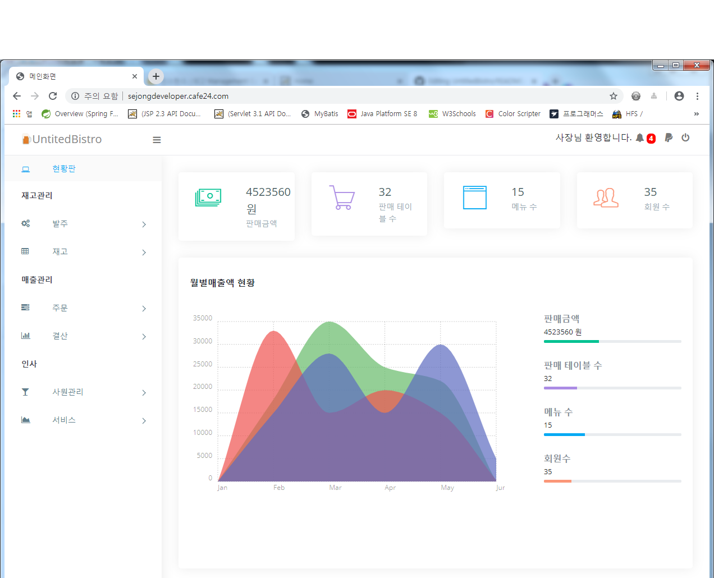

# UntitledBistro
비트캠프에서 만든 스프링 프로젝트입니다.

cafe24를 통하여 웹호스팅을 했습니다. 
http://sejongdeveloper.cafe24.com/

<pre>
목적: 요식업ERP + POS기능을 구현

사용언어: JAVA(8)
         ,JSP(2.1) 
         ,Servlet(3.1)
         ,HTML5
         ,CSS
         ,MariaDB(10.1)  
         ,Oracle(18c, cafe24 호스팅 전 사용언어)

사용도구: Spring(5.1.3)
         ,mybatis
         ,HikariCP(DB 콘솔출력)
         ,commons-fileupload
         ,jackson-databind
         ,tiles
         ,itextpdf(PDF)
         ,google(차트,달력)
         ,security(스프링 보안)
         ,DataTables(그리드)
         ,jsGrid(그리드)
         ,SweetAlert(비동기 알람창)
         
  
</pre>
